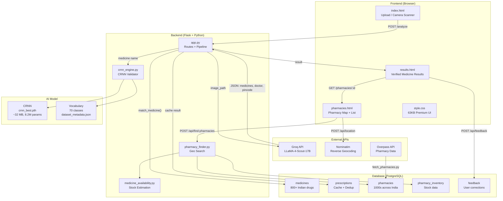
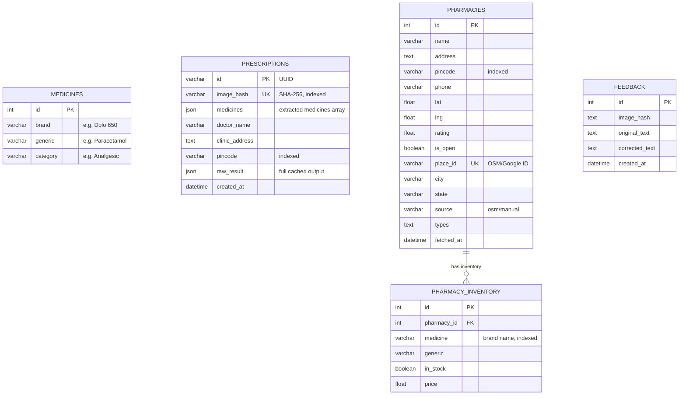

# 🔬 Complete Project Deep Analysis
## Intelligent Handwritten Medical Prescription Recognition & Safety Verification System
### B.Tech Final Year — Presentation & Viva Preparation Guide

---

# Step 1: Project Overview

## 1.1 What the Project Does (Simple Explanation)

> Imagine you visit a doctor and they write a prescription by hand.  
> The handwriting is often messy and hard to read.  
> This project lets you **take a photo of that prescription**, and an **AI system reads the medicine names**, verifies if they are real drugs, shows their generic names & categories, and then **finds nearby pharmacies** where those medicines are available.

## 1.2 What the Project Does (Technical Explanation)

This is a **full-stack AI-powered web application** that implements an end-to-end pipeline for:

1. **Image Ingestion** — Upload or camera-scan a handwritten prescription image (JPG/PNG/WEBP/BMP/PDF).
2. **Vision-Language Extraction** — A multimodal LLM (Groq API with LLaMA-4-Scout-17B) reads the prescription and extracts structured data: medicine names, dosages, frequencies, doctor name, clinic address, and pincode.
3. **CRNN Validation** — A custom-trained Convolutional Recurrent Neural Network validates each extracted medicine name by rendering it as a synthetic image and re-reading it via CRNN inference.
4. **Multi-Algorithm Medicine Matching** — Each medicine name is matched against a PostgreSQL database of 800+ Indian medicines using a weighted ensemble of RapidFuzz ratio, partial ratio, Jaro-Winkler phonetic similarity, and Levenshtein edit distance.
5. **Hallucination Filtering** — A rule-based filter removes non-medicine words (common English words, numeric-only strings, short tokens) that the LLM might hallucinate.
6. **Geo-Based Pharmacy Locator** — Finds nearby pharmacies using Haversine distance calculations with lat/lng coordinates or pincode-based fallback, checks medicine availability, and displays results on an interactive Leaflet.js map.
7. **Feedback Loop** — Users can confirm or correct recognized medicine names, building a correction dataset for future model improvement.

## 1.3 Problem Statement

> **"Doctors' handwritten prescriptions are difficult to read, leading to medication errors, patient safety risks, and pharmacy dispensing mistakes. There is no widely available, affordable system to digitize and verify handwritten prescriptions, especially in the Indian healthcare context."**

Key problems addressed:
- **Illegibility** — 60%+ of prescription errors stem from poor handwriting
- **Patient Safety** — Wrong medicine dispensing can be life-threatening
- **No Verification** — Pharmacists rely on guesswork when reading unclear prescriptions
- **Accessibility** — Existing OCR solutions don't handle medical terminology well
- **Pharmacy Discovery** — Patients struggle to find which pharmacy stocks their specific medicines

## 1.4 Solution Approach

A **multi-layered verification pipeline** where no single model has the final say:

```
Prescription Image
      │
      ▼
┌──────────────┐
│  Groq API    │ ← Stage 1: Vision-Language Model reads the image
│  (LLaMA-4)   │    Extracts: medicine names, dosages, frequencies,
└──────┬───────┘    doctor info, clinic address, pincode
       │
       ▼
┌──────────────┐
│ CRNN Model   │ ← Stage 2: Re-validates each medicine name
│ (CNN+BiLSTM) │    by rendering → inference → comparing
└──────┬───────┘
       │
       ▼
┌──────────────┐
│  DB Matching │ ← Stage 3: Fuzzy-matches against 800+ medicines
│  (RapidFuzz  │    using 4-algorithm weighted scoring
│  + Jellyfish)│
└──────┬───────┘
       │
       ▼
┌──────────────┐
│ Hallucination│ ← Stage 4: Removes non-medicine words
│   Filter     │
└──────┬───────┘
       │
       ▼
  Verified Results → Pharmacy Search → User Feedback
```

---

# Step 2: System Architecture

## 2.1 Full Architecture Diagram



## 2.2 Component Breakdown

### Frontend
| File | Size | Purpose |
|------|------|---------|
| [index.html](file:///e:/Sem%208%20Internship/PrescriptionWebApp/templates/index.html) | 17.5 KB | Upload page + drag-and-drop + camera scanner modal |
| [results.html](file:///e:/Sem%208%20Internship/PrescriptionWebApp/templates/results.html) | 19.8 KB | 3-stage verification display + feedback system |
| [pharmacies.html](file:///e:/Sem%208%20Internship/PrescriptionWebApp/templates/pharmacies.html) | 30.2 KB | Interactive Leaflet.js map + pharmacy cards + sorting |
| [style.css](file:///e:/Sem%208%20Internship/PrescriptionWebApp/static/style.css) | 63 KB | Full dark-mode glassmorphism design system |

**Design Features**: Glassmorphism, animated gradients, toast notifications, responsive layout, micro-animations, Inter font, Material Symbols icons.

### Backend
| File | Lines | Purpose |
|------|-------|---------|
| [app.py](file:///e:/Sem%208%20Internship/PrescriptionWebApp/app.py) | 782 | Main Flask app — routes, pipeline, medicine matching, Groq API, hallucination filter |
| [crnn_engine.py](file:///e:/Sem%208%20Internship/PrescriptionWebApp/crnn_engine.py) | 330 | CRNN model architecture + validation engine + CTC decoder + synthetic image renderer |
| [model.py](file:///e:/Sem%208%20Internship/PrescriptionWebApp/model.py) | 88 | SQLAlchemy ORM models (Medicine, Feedback, Prescription, Pharmacy, PharmacyInventory) |
| [pharmacy_finder.py](file:///e:/Sem%208%20Internship/PrescriptionWebApp/pharmacy_finder.py) | 433 | Haversine geo-search, pincode fallback, Nominatim reverse geocoding, inventory matching |
| [medicine_availability.py](file:///e:/Sem%208%20Internship/PrescriptionWebApp/medicine_availability.py) | 170 | 4-tier medicine stock estimation (Common → Chain → Category → Fallback) |
| [fetch_pharmacies.py](file:///e:/Sem%208%20Internship/PrescriptionWebApp/fetch_pharmacies.py) | 345 | OpenStreetMap Overpass API scraper for 100+ Indian cities |
| [seed_pharmacies.py](file:///e:/Sem%208%20Internship/PrescriptionWebApp/seed_pharmacies.py) | 340 | Mock pharmacy data generator covering all Indian pincode zones |

### Database
- **Engine**: PostgreSQL (running on `localhost:5433`)
- **ORM**: Flask-SQLAlchemy
- **Database Name**: `medical_prescription`

### AI/ML
- **Vision Model**: Groq API → LLaMA-4-Scout-17B (multimodal, reads images)
- **Validation Model**: Custom CRNN (CNN + BiLSTM + CTC), trained on 39,160 word-crop samples
- **Matching Algorithms**: RapidFuzz, Jellyfish (Jaro-Winkler, Metaphone), Levenshtein

## 2.3 Data Flow: Input → Output

```
User uploads prescription.jpg
  │
  ├─1→ File bytes read → SHA-256 hash computed
  │    └─ Check prescriptions table for cached result (duplicate detection)
  │       └─ If found → return cached results instantly
  │
  ├─2→ Image saved with hash-based filename (dedup storage)
  │    └─ PDF? → PyMuPDF converts page 1 to JPEG at 2× zoom
  │
  ├─3→ Image resized to max 1024px → base64 encoded
  │    └─ Sent to Groq API with detailed pharmacist prompt
  │    └─ Response parsed: medicines[], doctor_name, clinic_address, pincode
  │
  ├─4→ For each extracted medicine:
  │    ├─ a) match_medicine() → 4-algorithm fuzzy match against DB
  │    ├─ b) crnn_validator.validate() → synthetic render → CRNN inference
  │    ├─ c) is_hallucination() → filter non-medicine words
  │    └─ d) Combined score = 0.6 × DB_similarity + 0.4 × CRNN_confidence
  │
  ├─5→ Results classified:
  │    ├─ ≥ 85% → ✓ DB VERIFIED
  │    ├─ ≥ 70% → ◐ LIKELY MATCH
  │    ├─ ≥ 50% → ◐ PARTIALLY VERIFIED
  │    └─ < 50% → △ NEEDS REVIEW
  │
  ├─6→ Prescription stored in DB (UUID, hash, medicines, raw_result)
  │
  └─7→ results.html rendered with:
       ├─ Stats bar (Found / Accepted / Verified counts)
       ├─ Doctor & clinic metadata
       ├─ Per-medicine: name, dosage, frequency, generic, category,
       │   CRNN status, DB status, confidence bar, final verdict
       ├─ Rejected items (hallucinations)
       └─ "Find Nearby Pharmacies" CTA → links to pharmacy search
```

---

# Step 3: Core Features

## 3.1 Prescription Upload

**Location**: [index.html](file:///e:/Sem%208%20Internship/PrescriptionWebApp/templates/index.html) (lines 64–105) + [app.py](file:///e:/Sem%208%20Internship/PrescriptionWebApp/app.py) (lines 492–607)

| Feature | Implementation |
|---------|---------------|
| Drag & Drop | Native HTML5 DnD events on `.dropzone` div |
| Click to Browse | Hidden `<input type="file">` triggered by click |
| Image Preview | `FileReader.readAsDataURL()` displays preview before upload |
| File Validation | Client-side (16MB limit, extension check) + server-side (`allowed_file()`) |
| Supported Formats | JPG, JPEG, PNG, WEBP, BMP, PDF |
| PDF Support | PyMuPDF renders first page at 2× zoom to JPEG |
| Loading State | Full-screen overlay with animated pulse icon during analysis |

## 3.2 Camera Scanner

**Location**: [index.html](file:///e:/Sem%208%20Internship/PrescriptionWebApp/templates/index.html) (lines 107–166, 263–400)

- Full-screen modal using `navigator.mediaDevices.getUserMedia()`
- Back camera (environment) by default with switch button
- Resolution: `ideal: 1920×1080`
- Viewfinder with corner markers and alignment guide text
- Capture → Preview → Retake/Use workflow
- Captured photo converted via `canvas.toBlob()` → injected into upload form as `File`
- Error states for permission denied, no camera, etc.

## 3.3 Duplicate Detection (Image Hashing)

**Location**: [app.py](file:///e:/Sem%208%20Internship/PrescriptionWebApp/app.py) (lines 504–537)

```python
file_bytes = file.read()
file_hash = hashlib.sha256(file_bytes).hexdigest()  # 64-char hex

# Check DB for cached result
cached_rx = Prescription.query.filter_by(image_hash=file_hash).first()
if cached_rx and cached_rx.raw_result:
    return cached results  # Skip entire pipeline!
```

**How it works**:
1. Read raw file bytes before saving
2. Compute SHA-256 hash (deterministic, collision-resistant)
3. Query `prescriptions` table by `image_hash` column (indexed)
4. If found → return cached result immediately (zero API calls)
5. Also maintains a `.hash_index.json` file mapping hash → filename for storage dedup

> [!TIP]
> This saves Groq API quota and provides instant results for re-uploaded prescriptions.

## 3.4 Medicine Extraction

**Location**: [app.py](file:///e:/Sem%208%20Internship/PrescriptionWebApp/app.py) (lines 243–357)

The Groq API is called with a carefully engineered prompt that instructs the model to:
- Act as an "expert pharmacist"
- Extract ONLY clearly readable medicine names
- Remove prefixes (Tab., Cap., Syr., Inj.)
- Report confidence (high/medium)
- Also extract: `doctor_name`, `clinic_address`, `pincode`

**Image preprocessing before API call**:
1. Open with Pillow, convert to RGB
2. Resize longest side to max 1024px (preserve aspect ratio)
3. Compress as JPEG quality 95
4. Base64 encode for API payload

## 3.5 Medicine Validation (Multi-Algorithm Matching)

**Location**: [app.py](file:///e:/Sem%208%20Internship/PrescriptionWebApp/app.py) (lines 95–179)

Four scoring algorithms combined with weighted average:

| Algorithm | Weight | Library | What It Measures |
|-----------|--------|---------|-----------------|
| Fuzzy Ratio | 35% | `rapidfuzz.fuzz.ratio` | Token-level character similarity |
| Partial Ratio | 25% | `rapidfuzz.fuzz.partial_ratio` | Best substring match |
| Phonetic (Jaro-Winkler on Metaphone) | 20% | `jellyfish` | Sound-alike matching |
| Edit Distance (Levenshtein) | 20% | `jellyfish` or custom | Minimum character edits |

```
Combined Score = 0.35×fuzzy + 0.25×partial + 0.20×phonetic + 0.20×edit_score
```

**Classification thresholds**:
| Score | Status | Badge |
|-------|--------|-------|
| ≥ 0.85 | Verified ✓ | `DB_VERIFIED` |
| ≥ 0.70 | Likely Match | `DB_LIKELY` |
| ≥ 0.50 | Possible Match | `DB_POSSIBLE` |
| < 0.50 | Unverified | `DB_UNVERIFIED` |

## 3.6 Pharmacy Locator (Geo-Based)

**Location**: [pharmacy_finder.py](file:///e:/Sem%208%20Internship/PrescriptionWebApp/pharmacy_finder.py) + [pharmacies.html](file:///e:/Sem%208%20Internship/PrescriptionWebApp/templates/pharmacies.html)

**Search Strategy**:
1. **Preferred**: Lat/lng from browser `navigator.geolocation`
2. **Fallback**: Pincode → estimated coordinates from lookup table
3. **Geo-search**: SQL bounding box pre-filter → Haversine refinement
4. **Progressive radius**: 5km → 10km → 25km → 50km (expands if < 5 results)

**Medicine Availability** (3 paths):
- **Real Inventory**: Fuzzy-match against `pharmacy_inventory` table (threshold ≥ 65%)
- **Estimation**: 4-tier heuristic (Common drugs → Chain pharmacies → Category → "Call to Confirm")
- **Pharmacy Ranking**: Sort by `(-availability_pct, -rating, +distance_km)`

**Map**: Leaflet.js + OpenStreetMap tiles (100% free, no API key). Color-coded markers (green ≥ 80%, amber ≥ 50%, red < 50%).

---

# Step 4: AI/Model Explanation

## 4.1 What Model Is Used

A **custom-trained CRNN (Convolutional Recurrent Neural Network)** — specifically designed for text recognition in images.

| Property | Value |
|----------|-------|
| Architecture | CNN (7 conv layers) + BiLSTM (2 layers) + CTC Decoder |
| Total Parameters | 8,218,822 (~8.2 million) |
| Model Size | ~32.9 MB (float32) |
| Input | Grayscale image (1, 32, 128) |
| Output | Character sequence via CTC decoding |
| Classes | 70 (69 characters + 1 CTC blank) |
| Training Data | 39,160 word-crop images (31K train / 3.9K val / 3.9K test) |
| Trained On | Google Colab (T4 GPU), 50 epochs |
| Inference | CPU (local laptop), ~10–50ms per word |

## 4.2 How It Works (Simple Explanation)

Think of reading a word left-to-right:

1. **Eyes (CNN)**: Look at the image and recognize visual patterns — edges, curves, strokes → building up from simple features to complex character parts.

2. **Brain Context (BiLSTM)**: Read the character patterns in both directions (left-to-right AND right-to-left) to understand context. For example, if you see "Par_cetam_l", the context helps you fill in the blanks.

3. **Speaking (CTC Decoder)**: Convert the internal representation back to text, handling the fact that each character might span multiple image positions.

## 4.3 How It Works (Technical Explanation)

### CNN Feature Extractor (5 blocks, 7 conv layers)

```
Input: (batch, 1, 32, 128)   ← Grayscale image

Block 1: Conv2d(1→64) + BN + ReLU + MaxPool(2×2)     → (batch, 64, 16, 64)
Block 2: Conv2d(64→128) + BN + ReLU + MaxPool(2×2)    → (batch, 128, 8, 32)
Block 3: Conv2d(128→256) + Conv2d(256→256) + MaxPool(2×1)  → (batch, 256, 4, 32)
Block 4: Conv2d(256→512) + Conv2d(512→512) + MaxPool(2×1)  → (batch, 512, 2, 32)
Block 5: Conv2d(512→512, kernel=(2,1))                 → (batch, 512, 1, 32)
```

> [!IMPORTANT]
> **Key Design**: Blocks 3–4 use `MaxPool(2×1)` — pooling height only, preserving width.  
> This is because width = the "time axis" (horizontal sequence of characters).  
> Height is collapsed to 1, turning the 2D image into a 1D feature sequence.

### Reshape: 2D → 1D Sequence

```
(batch, 512, 1, 32) → squeeze height → (batch, 512, 32) → permute → (batch, 32, 512)
```

Each of the 32 "time steps" represents a vertical slice of the image with 512 features.

### BiLSTM Sequence Modeler

```
Input:  (batch, 32, 512)
LSTM:   2 layers, 256 hidden units, bidirectional
Output: (batch, 32, 512)   ← 256 forward + 256 backward concatenated
```

The BiLSTM captures context in both directions — important because "P" at position 0 affects the reading of "l" at position 10 in "Paracetamol".

### Fully Connected + CTC

```
FC Layer:    (batch, 32, 512) → (batch, 32, 70)     ← 70 character classes
LogSoftmax:  probability distribution over characters at each timestep
Transpose:   (32, batch, 70)                         ← CTC expects (T, N, C)
```

### CTC (Connectionist Temporal Classification) Decoding

CTC solves the alignment problem: the model outputs 32 timesteps but a word like "Dolo" is only 4 characters.

**Greedy decoding algorithm**:
1. Take `argmax` at each timestep → e.g., `[0,0,D,D,D,o,o,l,l,l,o,o,0,0,...]`
2. Collapse consecutive duplicates → `[0,D,o,l,o,0]`
3. Remove blank tokens (index 0) → `[D,o,l,o]`
4. Map indices to characters → `"Dolo"`

## 4.4 Why CRNN Was Chosen

| Reason | Explanation |
|--------|-------------|
| **Segmentation-free** | No need to isolate individual characters — reads the whole word at once |
| **Handles variable-length output** | CTC loss aligns any length of text to the fixed-width image |
| **Proven for OCR** | Based on Shi et al. (2016) — the foundational paper for scene text recognition |
| **Lightweight** | 32 MB model runs on CPU in < 50ms — deployable on any laptop |
| **Custom-trainable** | Trained on medical terminology, not generic English text |

## 4.5 Preprocessing Steps

| Step | Detail |
|------|--------|
| Load image | `cv2.imread(path, cv2.IMREAD_GRAYSCALE)` |
| Resize | `cv2.resize(img, (128, 32))` — fixed dimensions |
| Normalize | `img / 255.0` → values in [0, 1] range |
| Channel dim | `np.expand_dims(img, axis=0)` → (1, 32, 128) |
| Tensor | `torch.FloatTensor` for PyTorch |

> [!NOTE]
> For the **validation use case** (not OCR from real images), the CRNN engine **renders** the medicine name text as a synthetic 32×128 grayscale image using PIL, then feeds it to the model. If the model reads it back correctly, it confirms the name is a valid medicine-like word.

## 4.6 Output Format

Each medicine gets a combined result:

```json
{
  "name": "Paracetamol",
  "dosage": "500mg",
  "frequency": "1-0-1",
  "api_confidence": "high",
  "db_match": "Paracetamol",
  "generic": "Paracetamol",
  "category": "Analgesic",
  "similarity": 100,
  "crnn_status": "CRNN_CONFIRMED ✓ (conf: 99%)",
  "db_status": "DB_VERIFIED ✓ (sim: 100%)",
  "final_status": "✓ DB VERIFIED (score: 100%)",
  "combined_score": 100,
  "is_hallucination": false
}
```

---

# Step 5: Database Design

## 5.1 Entity-Relationship Overview



## 5.2 Table Details

### `medicines` — Master Drug Database
- **800+ records** loaded from `medicine_database.json`
- Each entry: `brand` (trade name), `generic` (chemical name), `category` (drug class)
- Covers: Analgesics, NSAIDs, Antibiotics, Antifungals, Antivirals, Cardiovascular, Diabetes, Dermatology, GI, Respiratory, Psychiatric, and more
- Used for fuzzy matching of extracted medicine names

### `prescriptions` — Cache & Dedup Store
- **Primary key**: UUID (generated server-side)
- **`image_hash`**: SHA-256 of original file → enables instant dedup
- **`raw_result`**: Full JSON result stored for cache reuse
- **`medicines`**: Array of {name, dosage, frequency}
- **`pincode`**: Extracted from prescription → used as default for pharmacy search

### `pharmacies` — Pharmacy Directory
- Sources: manual seed data (200+ pharmacies) + OpenStreetMap Overpass API (100+ Indian cities)
- **Geo-indexed**: `lat`, `lng` for Haversine search; `pincode` for fallback
- **`place_id`**: Unique OSM/Google ID to prevent duplicates
- Coverage: All Indian pincode zones (1xx through 9xx)

### `pharmacy_inventory` — Medicine Stock
- Links pharmacies to medicines they stock
- Each record: pharmacy_id, medicine name, generic name, in_stock flag, price
- Generated by seed script: each pharmacy stocks 40–80% of all medicines
- Fuzzy-matched (threshold 65%) when checking availability

### `feedback` — User Corrections
- Stores user corrections: `original_text` → `corrected_text`
- Enables future retraining of the CRNN model
- Also stored in browser `localStorage` for immediate client-side reuse

## 5.3 Key Relationships & Logic

1. **Prescription → Pharmacy Search**: `prescriptions.pincode` auto-populates the pharmacy search location
2. **Pharmacy → Inventory**: One-to-many via `pharmacy_id` FK with `backref='inventory'`
3. **No direct FK between medicines ↔ inventory**: Matching is fuzzy (string similarity), not by ID — realistic because pharmacists may stock different brand spellings
4. **Feedback is standalone**: Not FK'd to prescriptions — collects corrections independently for model improvement

---

# Step 6: Key Technical Decisions

## 6.1 Why PostgreSQL?

| Factor | PostgreSQL | SQLite (alternative) |
|--------|-----------|---------------------|
| **JSON columns** | Native `JSON`/`JSONB` support — used for `medicines[]` and `raw_result` | Limited JSON support |
| **Concurrent access** | Multi-connection safe | Single-writer lock |
| **Indexing** | B-tree indexes on `image_hash`, `pincode`, `place_id` | Basic indexing |
| **Scalability** | Production-ready, handles thousands of records | File-based, dev-only |
| **Geo queries** | Could use PostGIS extension in future | Not available |

> Decision: The project stores structured + semi-structured data (JSON arrays of medicines, full result cache). PostgreSQL's native JSON support makes this clean without needing a separate NoSQL database.

## 6.2 Why Groq API + LLaMA (Not Custom OCR End-to-End)?

| Factor | Decision |
|--------|----------|
| **Handwriting quality** | Indian doctor handwriting is extremely varied — training a single OCR model to 95%+ accuracy would require 50K+ labeled samples |
| **Multimodal understanding** | LLaMA-4-Scout-17B understands context (medical vocabulary, prescription layout) — not just character recognition |
| **Metadata extraction** | Simultaneously extracts doctor name, clinic address, pincode — a pure OCR model cannot infer these semantically |
| **Time constraints** | B.Tech final year → limited time to collect/label enough training data |
| **Cost** | Groq provides free API tier with generous limits |

> The Groq API is the **primary text extractor**, and the custom CRNN acts as a **secondary validator** — ensuring the LLM's output is plausible.

## 6.3 Why Custom CRNN Model (Not Just API)?

| Reason | Detail |
|--------|--------|
| **Academic requirement** | A B.Tech project needs to demonstrate model training, not just API calling |
| **Validation layer** | CRNN provides independent verification — if both API and CRNN agree, confidence is higher |
| **Offline capability** | CRNN runs on CPU locally — works even without internet |
| **Demonstrates understanding** | Shows knowledge of CNN, LSTM, CTC loss, custom dataset creation |

## 6.4 Why Geo-Based Search Instead of ML for Pharmacy Finding?

| Factor | Geo-Based (chosen) | ML-Based (alternative) |
|--------|-------------------|----------------------|
| **Data availability** | Pharmacy locations exist in OSM | No training data for "which pharmacy stocks what" |
| **Determinism** | Haversine distances are mathematically exact | ML predictions would be probabilistic |
| **Explainability** | "5.2 km away" is understandable | "87% likelihood of having Paracetamol" is opaque |
| **Real-time stock** | Not available in India — estimation is inherently heuristic | ML can't predict real stock without data |
| **Implementation cost** | Standard algorithm, no training needed | Would need labeled pharmacy-stock dataset |

---

# Step 7: Challenges & Solutions

## Challenge 1: LLM Hallucinations

**Problem**: The Groq API sometimes generates fake medicine names that look real but don't exist (e.g., "Cardizem" when the prescription actually says "Cardem").

**Solution**: Multi-layer filtering:
1. **Hallucination filter** (`is_hallucination()`) — rejects names < 3 chars, common English words, pure numbers
2. **DB matching** — low similarity score (< 50%) flags uncertain names
3. **CRNN validation** — if CRNN can't read its own rendered text back, something is wrong
4. **Combined scoring** — `0.6 × DB_sim + 0.4 × CRNN_conf` — both must agree

## Challenge 2: Variable Prescription Formats

**Problem**: Indian prescriptions vary wildly — handwritten on blank paper, printed letterheads, stamps, mixed Hindi/English, medicine prefixes (Tab., Cap., Syr.), and no standardized layout.

**Solution**:
- Detailed prompt engineering for the Groq API with explicit rules
- `clean_medicine_name()` regex strips common prefixes: `Tab.`, `Cap.`, `Syr.`, `Inj.`, `Susp.`, `Cr.`, `Oint.`
- Medicine DB includes both brand names (Dolo 650) and generic names (Paracetamol)
- Fuzzy matching handles OCR errors in medicine names

## Challenge 3: No Real Pharmacy Stock API in India

**Problem**: Unlike developed countries, India has no public API for real-time pharmacy inventory data.

**Solution**: A 4-tier estimation system (`medicine_availability.py`):
1. **Tier 1**: 70+ common OTC medicines (Paracetamol, Amoxicillin, etc.) → "Likely Available"
2. **Tier 2**: Major chain detection (Apollo, MedPlus, etc.) → "Probably Available" for most medicines
3. **Tier 3**: Drug category heuristic (Antibiotics, Analgesics) → "Probably Available"
4. **Tier 4**: Fallback → "Call to Confirm" with pharmacy phone number

## Challenge 4: Pharmacy Data Collection

**Problem**: The project needed thousands of Indian pharmacy locations with coordinates.

**Solution**: **OpenStreetMap Overpass API** (100% free)
- `fetch_pharmacies.py` queries 100+ Indian cities with city-center + radius queries
- Handles rate limiting (429), timeouts (504), progressive radius reduction
- Checkpointing allows resume after interruption
- Supplements with seeded mock data covering all Indian pincode zones

## Challenge 5: PDF Prescription Support

**Problem**: Some users scan prescriptions to PDF, not images.

**Solution**: PyMuPDF renders the first page at 2× zoom factor to a JPEG:
```python
mat = fitz.Matrix(2.0, 2.0)  # 2x zoom for better quality
pix = page.get_pixmap(matrix=mat)
pix.save(img_path)
```

## Challenge 6: Windows Console Encoding Errors

**Problem**: Unicode characters in pharmacy names (from OSM) caused crashes on Windows.

**Solution**: Force UTF-8 encoding for stdout:
```python
sys.stdout = io.TextIOWrapper(sys.stdout.buffer, encoding='utf-8', errors='replace')
```

---

# Step 8: Limitations

## 8.1 Current Limitations

| # | Limitation | Impact | Difficulty to Fix |
|---|-----------|--------|-------------------|
| 1 | **CRNN validates synthetically-rendered text, not real handwriting** | CRNN confirms the name *looks* like a word, but doesn't read actual handwriting from the image | 🔴 High — needs real handwriting training data |
| 2 | **Depends on Groq API (internet required for extraction)** | No internet = no medicine extraction — only CRNN works offline | 🟡 Medium — could add local OCR fallback |
| 3 | **Medicine DB is limited to ~800 Indian drugs** | Rare, specialty, or very new medicines may not match | 🟢 Easy — add more entries to `medicine_database.json` |
| 4 | **Pharmacy stock data is estimated, not real-time** | "Likely Available" may not reflect actual current stock | 🔴 High — no public API exists in India |
| 5 | **No multi-page prescription support** | Only the first page of PDFs is processed | 🟢 Easy — loop through all pages |
| 6 | **Bengali/regional language prescriptions not supported** | System works only with English and transliterated medicine names | 🔴 High — needs multilingual model |
| 7 | **No drug interaction checking** | Doesn't warn about dangerous medicine combinations | 🟡 Medium — needs drug interaction database |
| 8 | **Groq API rate limits** | High traffic could hit API quota limits (429 errors) | 🟡 Medium — add queuing or local model |
| 9 | **No user authentication** | Anyone can access — no patient privacy controls | 🟡 Medium — add Flask-Login |
| 10 | **CRNN trained on limited dataset (39K samples)** | May not generalize to all medicine name patterns | 🟡 Medium — collect more data |

## 8.2 What Can Be Improved

1. **Train CRNN on real handwritten prescription crops** (not just synthetic renders)
2. **Add a local TrOCR or PaddleOCR model** as API fallback
3. **Integrate a drug interaction database** (e.g., DrugBank API) for safety warnings
4. **Add dosage validation** (e.g., "Paracetamol 5000mg" is dangerous)
5. **User accounts** with prescription history and reminders
6. **Mobile app** using React Native or Flutter for camera-first UX
7. **Expand medicine DB** to include 5000+ medicines
8. **Real-time pharmacy integration** if APIs become available
9. **Support multi-page and multi-prescription** uploads
10. **Add Bengali, Hindi, Tamil, and other regional language support**

---

# Step 9: Possible Viva Questions & Answers

## Q1: What is CRNN and why did you use it?
**A**: CRNN stands for Convolutional Recurrent Neural Network. It combines CNN (for visual feature extraction from images) with BiLSTM (for sequence modeling). I used it because it's segmentation-free (reads whole words without isolating characters), handles variable-length output via CTC loss, and is lightweight enough (~32 MB) to run on CPU for real-time validation.

## Q2: Explain the CTC loss function.
**A**: CTC (Connectionist Temporal Classification) solves the alignment problem — the model outputs 32 time steps but a word like "Dolo" is only 4 characters. CTC considers ALL possible alignments (e.g., "D-D-o-o-l-l-o" and "–D-o-l-o–-") and maximizes the total probability of the correct label. It uses a special `<BLANK>` token (index 0) to separate repeated characters and handle variable-length alignment.

## Q3: Why did you use Groq API instead of building your own OCR from scratch?
**A**: Two reasons: (1) Doctor handwriting in India is extremely diverse — training a robust OCR from scratch requires 50,000+ labeled samples, which wasn't feasible in the project timeline. (2) The Groq Vision model (LLaMA-4-Scout-17B) understands medical context — it doesn't just recognize characters but understands that "Tab" means tablet and that medicine names follow certain patterns. My CRNN serves as a secondary validation layer, satisfying the academic requirement of custom model training.

## Q4: How does your medicine matching algorithm work?
**A**: I use a weighted ensemble of 4 algorithms: (1) RapidFuzz ratio (35%) for overall character similarity, (2) Partial ratio (25%) for best substring match, (3) Jaro-Winkler on Metaphone codes (20%) for phonetic/sound-alike matching, (4) Levenshtein edit distance (20%) for minimum character edits. The combined score is classified: ≥85% = Verified, ≥70% = Likely, ≥50% = Possible, <50% = Unverified.

## Q5: What is the Haversine formula and why did you use it?
**A**: The Haversine formula calculates the great-circle distance between two points on a sphere using their latitudes and longitudes. I used it for finding nearby pharmacies because it gives accurate distances on Earth's surface. The formula is: `d = 2R × arctan2(√a, √(1-a))` where `a = sin²(Δlat/2) + cos(lat1)×cos(lat2)×sin²(Δlng/2)`. I first use a SQL bounding box pre-filter for speed, then refine with exact Haversine distances.

## Q6: How do you handle hallucinations from the LLM?
**A**: My `is_hallucination()` function uses multiple checks: (1) Reject names shorter than 3 characters, (2) reject common English words (from a 30+ word blocklist like "doctor", "daily", "morning"), (3) reject pure digit strings, (4) keep names that match the medicine DB with ≥60% similarity, (5) keep high-confidence API outputs if the name is ≥4 characters. This prevents common false positives like "Daily" or "Dr." being treated as medicines.

## Q7: Explain your database schema and why you chose PostgreSQL.
**A**: I have 5 tables: `medicines` (800+ drug reference data), `prescriptions` (cached results with SHA-256 dedup), `pharmacies` (geolocated stores), `pharmacy_inventory` (stock data with FK to pharmacies), and `feedback` (user corrections). I chose PostgreSQL because: (a) native JSON column support for storing flexible medicine arrays and full result cache, (b) proper indexing for geo-queries and hash lookups, (c) concurrent multi-user safe, (d) production-grade and extensible with PostGIS for future spatial queries.

## Q8: How does the duplicate detection work?
**A**: Before any processing, I read the raw file bytes and compute a SHA-256 hash. I query the `prescriptions` table by `image_hash` (which has a UNIQUE index). If found, I return the cached `raw_result` immediately — zero API calls, instant response. This saves API quota and provides fast repeat lookups. Same-content files always produce the same hash regardless of filename.

## Q9: What is the difference between your CRNN model and the Groq API's role?
**A**: The Groq API (LLaMA-4-Scout-17B) is a multimodal vision-language model that **reads the actual handwritten prescription image** and extracts medicine names, dosages, and metadata. The CRNN model's role is different — it **validates** each extracted name by: rendering it as a synthetic text image → running CRNN inference to read it back → comparing the input to the output. If the CRNN can accurately reproduce the name, it's likely a real pharmaceutical word, not a hallucination.

## Q10: How do you estimate medicine availability at pharmacies?
**A**: I use a 4-tier heuristic system: Tier 1 checks against 70+ common OTC medicines (Paracetamol, Amoxicillin, etc.) — these are available at virtually every pharmacy. Tier 2 detects major chain names (Apollo, MedPlus) — chains stock 90%+ of brands. Tier 3 checks the drug category (common categories like Antibiotic, Analgesic are widely stocked). Tier 4 falls back to "Call to Confirm" with the pharmacy's phone number.

## Q11: What preprocessing do you perform on prescription images?
**A**: For the Groq API: (1) Open with Pillow, convert to RGB, (2) resize longest side to max 1024px preserving aspect ratio, (3) compress as JPEG quality 95, (4) base64 encode. For the CRNN: (1) Load as grayscale, (2) resize to 32×128, (3) normalize to [0,1] range, (4) add channel dimension for PyTorch.

## Q12: How did you collect pharmacy data?
**A**: Two sources: (1) **OpenStreetMap Overpass API** — a free public API. My `fetch_pharmacies.py` script queries 100+ Indian cities using `[amenity=pharmacy]` around city centers with progressive search radii. It handles rate limits, timeouts, and includes checkpointing for resilience. (2) **Seed data** — `seed_pharmacies.py` generates mock pharmacies across all Indian pincode zones with randomized inventory (40–80% of medicines stocked).

## Q13: Explain the architecture of your CNN feature extractor.
**A**: My CNN has 5 blocks with 7 convolutional layers. Blocks 1–2 use standard 2×2 max pooling (halving both height and width). Blocks 3–4 use 2×1 max pooling (halving height only, preserving width). This is the key design — width becomes the "time axis" for the LSTM. Block 5 uses a (2,1) kernel to collapse the remaining height to 1. Final output: (batch, 512, 1, 32) — 32 time steps, each with 512 features.

## Q14: What is BiLSTM and why bidirectional?
**A**: BiLSTM (Bidirectional Long Short-Term Memory) processes the sequence in both forward and backward directions. This is critical for text recognition because context flows both ways — seeing "ol" at the end of a word helps confirm "Paracetam" at the beginning. Each direction produces 256-dimensional hidden states, concatenated to 512 dimensions per timestep.

## Q15: How does the feedback system work?
**A**: Users can mark each detected medicine as "Correct" or "Incorrect". If incorrect, they enter the corrected name. Corrections are: (1) stored in PostgreSQL's `feedback` table via `POST /api/feedback`, (2) saved in browser `localStorage` for immediate re-application on future visits. This creates a labeled correction dataset that could be used to retrain or fine-tune the model in the future.

## Q16: What are the main challenges you faced?
**A**: Five major challenges: (1) LLM hallucinations — solved with multi-layer filtering. (2) Variable prescription formats — solved with prompt engineering and regex cleaning. (3) No real pharmacy stock API in India — solved with 4-tier estimation heuristic. (4) Pharmacy data collection — solved with OpenStreetMap Overpass API (free). (5) Windows encoding crashes — solved by forcing UTF-8 console encoding.

## Q17: What is the combined score formula and why those weights?
**A**: `Combined Score = 0.6 × DB_similarity + 0.4 × CRNN_confidence`. DB similarity gets higher weight (60%) because it directly validates against real medicine names. CRNN confidence gets 40% because it validates the structural plausibility of the name. If CRNN is not loaded, the score falls back to DB similarity alone. This ensures a verified result requires agreement from both systems.

## Q18: Can your system work offline?
**A**: Partially. The CRNN model runs on CPU locally (no internet needed). The medicine DB matching and pharmacy search also work locally against PostgreSQL. However, the primary extraction step (Groq API) requires internet. A future improvement would be to add a local OCR model (like TrOCR or PaddleOCR) as an offline fallback.

## Q19: How do you handle the camera scanner in the browser?
**A**: I use the Web `MediaDevices.getUserMedia()` API to access the device camera, defaulting to the rear camera (`facingMode: 'environment'`). The video stream is displayed in a full-screen modal with an alignment frame. When the user taps capture, I draw the video frame onto a hidden `<canvas>`, convert it to a JPEG blob, create a `File` object, and inject it into the upload form's file input using `DataTransfer`. Then the normal upload flow proceeds.

## Q20: What metrics did you use to evaluate your CRNN model?
**A**: Three metrics: (1) **CER (Character Error Rate)** — edit distance / max string length, averaged over all predictions. (2) **WER (Word Error Rate)** — percentage of words not perfectly predicted. (3) **Accuracy** — percentage of exactly correct word predictions. The model was trained for 50 epochs with ReduceLROnPlateau scheduler, saved at the best CER checkpoint. Training data: 31,328 samples; validation: 3,916 samples; test: 3,916 samples.

---

# Step 10: Quick Reference Cheat Sheet

## Tech Stack Summary

| Layer | Technology |
|-------|-----------|
| Frontend | HTML5, CSS3 (glassmorphism), JavaScript (vanilla), Leaflet.js |
| Backend | Python 3, Flask, Flask-SQLAlchemy |
| Database | PostgreSQL 15 |
| AI/Vision | Groq API (LLaMA-4-Scout-17B) |
| AI/Local | Custom CRNN (PyTorch, CPU inference) |
| Matching | RapidFuzz, Jellyfish, custom Levenshtein |
| Maps | Leaflet.js + OpenStreetMap tiles |
| Data Sources | OpenStreetMap Overpass API, Nominatim |
| Dev Tools | Google Colab (training), VS Code, pgAdmin |

## File Structure Quick Map

```
PrescriptionWebApp/
├── app.py                    ← Main Flask app (782 lines)
├── crnn_engine.py            ← CRNN model + validator (330 lines)
├── model.py                  ← SQLAlchemy ORM models (88 lines)
├── db.py                     ← Database instance (3 lines)
├── pharmacy_finder.py        ← Geo-search + inventory match (433 lines)
├── medicine_availability.py  ← Stock estimation (170 lines)
├── fetch_pharmacies.py       ← OSM data collector (345 lines)
├── seed_pharmacies.py        ← Mock data generator (340 lines)
├── migrate_medicines.py      ← JSON → PostgreSQL migration
├── migrate_pharmacies.py     ← Schema migration script
├── medicine_database.json    ← 800+ Indian medicines
├── requirements.txt          ← Python dependencies
├── .env                      ← DATABASE_URL config
├── templates/
│   ├── index.html            ← Upload + camera scanner
│   ├── results.html          ← Verified results + feedback
│   └── pharmacies.html       ← Map + pharmacy cards
├── static/
│   └── style.css             ← 63KB design system
├── CRNN_Checkpoints-*/       ← crnn_best.pth (~33 MB)
├── CRNN_Dataset-*/           ← 39,160 word crops + metadata
├── Custom_CRNN_Model.ipynb   ← Training notebook (Colab)
├── Prescription_Recognition_Pipeline.ipynb
└── Graphs/                   ← Training visualization images
```

## Key Numbers to Remember

| Metric | Value |
|--------|-------|
| CRNN Parameters | 8,218,822 (~8.2M) |
| CRNN Model Size | ~32.9 MB (float32) |
| CRNN Classes | 70 (69 chars + 1 blank) |
| Training Samples | 31,328 (train) + 3,916 (val) + 3,916 (test) |
| Training Epochs | 50 |
| Medicine Database | ~800 Indian drugs |
| Pharmacy Coverage | 100+ Indian cities |
| Image Input Size | 32 × 128 pixels (grayscale) |
| LSTM Hidden Size | 256 per direction (512 bidirectional) |
| Matching Weights | Fuzzy 35%, Partial 25%, Phonetic 20%, Edit 20% |
| Combined Score | 60% DB + 40% CRNN |
